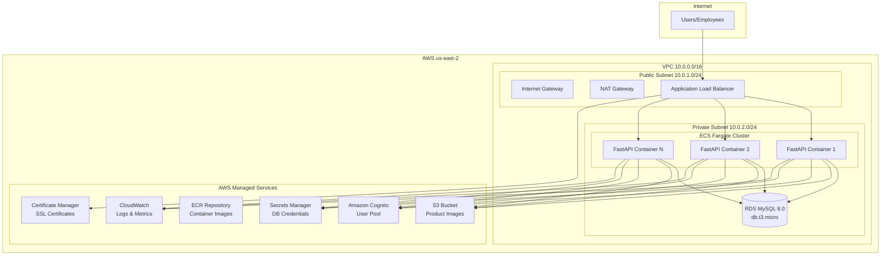

# Deployment Architecture - Core Business Unit

## Architecture Overview

This document provides detailed deployment architecture for the AWSomeShop Core Business Unit, including network topology, security boundaries, and component interactions.

## High-Level Architecture Diagram



## Network Architecture

### VPC Configuration
```yaml
VPC Specifications:
  - CIDR Block: 10.0.0.0/16
  - Region: us-east-2
  - Availability Zone: us-east-2a (single AZ for cost optimization)
  - DNS Hostnames: Enabled
  - DNS Resolution: Enabled
```

### Subnet Design
```yaml
Public Subnet (10.0.1.0/24):
  - Internet Gateway: Attached
  - Route Table: 0.0.0.0/0 → Internet Gateway
  - Resources: ALB, NAT Gateway
  - Auto-assign Public IP: Enabled

Private Subnet (10.0.2.0/24):
  - NAT Gateway: For outbound internet access
  - Route Table: 0.0.0.0/0 → NAT Gateway
  - Resources: ECS Tasks, RDS Instance
  - Auto-assign Public IP: Disabled
```

### Security Groups

#### ALB Security Group
```yaml
Name: awsomeshop-alb-sg
Inbound Rules:
  - Port 443 (HTTPS): 0.0.0.0/0
  - Port 80 (HTTP): 0.0.0.0/0 (redirects to HTTPS)
Outbound Rules:
  - Port 8000: ECS Security Group (FastAPI application)
```

#### ECS Security Group
```yaml
Name: awsomeshop-ecs-sg
Inbound Rules:
  - Port 8000: ALB Security Group
Outbound Rules:
  - Port 443: 0.0.0.0/0 (HTTPS for AWS API calls)
  - Port 3306: RDS Security Group (MySQL)
```

#### RDS Security Group
```yaml
Name: awsomeshop-rds-sg
Inbound Rules:
  - Port 3306: ECS Security Group
Outbound Rules:
  - None (database should not initiate outbound connections)
```

## Application Layer Architecture

### ECS Fargate Configuration

#### Cluster Specification
```yaml
Cluster Name: awsomeshop-cluster
Launch Type: Fargate
Platform Version: LATEST
Capacity Providers: FARGATE
```

#### Service Configuration
```yaml
Service Name: awsomeshop-core-service
Task Definition: awsomeshop-core-task
Desired Count: 2
Min Capacity: 2
Max Capacity: 10
Deployment Configuration:
  - Maximum Percent: 200
  - Minimum Healthy Percent: 50
  - Deployment Circuit Breaker: Enabled
```

#### Task Definition
```yaml
Family: awsomeshop-core-task
Network Mode: awsvpc
Requires Compatibilities: FARGATE
CPU: 512 (0.5 vCPU)
Memory: 1024 (1 GB)
Execution Role: ecsTaskExecutionRole
Task Role: awsomeshop-task-role

Container Definition:
  - Name: fastapi-app
  - Image: {account-id}.dkr.ecr.us-east-2.amazonaws.com/awsomeshop:latest
  - Port Mappings: 8000:8000
  - Log Driver: awslogs
  - Environment Variables:
    - AWS_REGION: us-east-2
    - LOG_LEVEL: INFO
  - Secrets:
    - DATABASE_URL: arn:aws:secretsmanager:us-east-2:{account}:secret:awsomeshop/db
    - COGNITO_USER_POOL_ID: arn:aws:secretsmanager:us-east-2:{account}:secret:awsomeshop/cognito
```

### Auto Scaling Configuration

#### Target Tracking Policies
```yaml
CPU Utilization Policy:
  - Target Value: 70%
  - Scale Out Cooldown: 300 seconds
  - Scale In Cooldown: 300 seconds

Memory Utilization Policy:
  - Target Value: 80%
  - Scale Out Cooldown: 300 seconds
  - Scale In Cooldown: 300 seconds
```

#### Step Scaling Policies
```yaml
Scale Out Policy:
  - Metric: CPU > 70% for 2 consecutive periods
  - Action: Add 1 task
  - Cooldown: 300 seconds

Scale In Policy:
  - Metric: CPU < 30% for 5 consecutive periods
  - Action: Remove 1 task
  - Cooldown: 300 seconds
```

## Data Layer Architecture

### RDS MySQL Configuration

#### Instance Specifications
```yaml
Engine: MySQL 8.0.35
Instance Class: db.t3.micro
  - vCPUs: 2
  - Memory: 1 GB
  - Network Performance: Up to 5 Gigabit
Storage:
  - Type: General Purpose SSD (gp2)
  - Size: 20 GB
  - IOPS: 100 (baseline)
```

#### Database Configuration
```yaml
Multi-AZ: false (single AZ for cost optimization)
Publicly Accessible: false
VPC Security Groups: awsomeshop-rds-sg
DB Subnet Group: awsomeshop-db-subnet-group
Parameter Group: default.mysql8.0
Option Group: default:mysql-8-0

Backup Configuration:
  - Automated Backups: Enabled
  - Backup Retention: 30 days
  - Backup Window: 03:00-04:00 UTC
  - Copy Tags to Snapshots: Enabled

Maintenance:
  - Maintenance Window: Sun:04:00-Sun:05:00 UTC
  - Auto Minor Version Upgrade: Enabled
```

#### Database Schema
```sql
-- Core database tables for AWSomeShop
CREATE DATABASE awsomeshop;

-- User points tracking
CREATE TABLE user_points (
    user_id VARCHAR(255) PRIMARY KEY,
    current_points INT NOT NULL DEFAULT 0,
    total_earned INT NOT NULL DEFAULT 0,
    total_redeemed INT NOT NULL DEFAULT 0,
    created_at TIMESTAMP DEFAULT CURRENT_TIMESTAMP,
    updated_at TIMESTAMP DEFAULT CURRENT_TIMESTAMP ON UPDATE CURRENT_TIMESTAMP,
    INDEX idx_user_points (current_points),
    INDEX idx_updated_at (updated_at)
);

-- Product catalog
CREATE TABLE products (
    product_id VARCHAR(255) PRIMARY KEY,
    name VARCHAR(255) NOT NULL,
    description TEXT,
    points_cost INT NOT NULL,
    category VARCHAR(100),
    image_url VARCHAR(500),
    is_active BOOLEAN DEFAULT true,
    stock_quantity INT DEFAULT 0,
    created_at TIMESTAMP DEFAULT CURRENT_TIMESTAMP,
    updated_at TIMESTAMP DEFAULT CURRENT_TIMESTAMP ON UPDATE CURRENT_TIMESTAMP,
    INDEX idx_category (category),
    INDEX idx_points_cost (points_cost),
    INDEX idx_active (is_active)
);

-- Order management
CREATE TABLE orders (
    order_id VARCHAR(255) PRIMARY KEY,
    user_id VARCHAR(255) NOT NULL,
    product_id VARCHAR(255) NOT NULL,
    points_used INT NOT NULL,
    status ENUM('Delivered') DEFAULT 'Delivered',
    created_at TIMESTAMP DEFAULT CURRENT_TIMESTAMP,
    FOREIGN KEY (product_id) REFERENCES products(product_id),
    INDEX idx_user_orders (user_id),
    INDEX idx_order_date (created_at)
);

-- Points transaction history
CREATE TABLE points_transactions (
    transaction_id VARCHAR(255) PRIMARY KEY,
    user_id VARCHAR(255) NOT NULL,
    transaction_type ENUM('earned', 'redeemed') NOT NULL,
    points_amount INT NOT NULL,
    order_id VARCHAR(255),
    description VARCHAR(255),
    created_at TIMESTAMP DEFAULT CURRENT_TIMESTAMP,
    INDEX idx_user_transactions (user_id),
    INDEX idx_transaction_date (created_at),
    INDEX idx_transaction_type (transaction_type)
);
```

### S3 Storage Configuration

#### Bucket Specifications
```yaml
Bucket Name: awsomeshop-product-images-{random-suffix}
Region: us-east-2
Storage Class: Standard
Versioning: Disabled
Lifecycle Policies: None
Public Access: Blocked (private bucket)

Encryption:
  - Server-Side Encryption: AES-256
  - Bucket Key: Enabled for cost optimization

Access Control:
  - Bucket Policy: ECS task role access only
  - CORS Configuration: Enabled for web uploads
```

## Security Architecture

### Identity and Access Management

#### IAM Roles and Policies

##### ECS Task Execution Role
```yaml
Role Name: awsomeshop-ecs-execution-role
Managed Policies:
  - AmazonECSTaskExecutionRolePolicy
Custom Policies:
  - ECR image pull permissions
  - CloudWatch logs creation
  - Secrets Manager read access
```

##### ECS Task Role
```yaml
Role Name: awsomeshop-ecs-task-role
Custom Policies:
  - RDS connect permissions
  - S3 bucket read/write access
  - Cognito user pool access
  - CloudWatch metrics publishing
```

### Cognito User Pool Configuration

#### User Pool Settings
```yaml
Pool Name: awsomeshop-users
Username Attributes: email
Auto Verified Attributes: email
Password Policy:
  - Minimum Length: 8
  - Require Uppercase: true
  - Require Lowercase: true
  - Require Numbers: true
  - Require Symbols: false

MFA Configuration: Optional
Account Recovery: Email only
```

#### App Client Configuration
```yaml
Client Name: awsomeshop-web-client
Generate Client Secret: true
Auth Flows:
  - ALLOW_USER_PASSWORD_AUTH
  - ALLOW_REFRESH_TOKEN_AUTH
Token Validity:
  - Access Token: 1 hour
  - ID Token: 1 hour
  - Refresh Token: 30 days
```

### SSL/TLS Configuration

#### Certificate Manager
```yaml
Certificate Type: Public certificate
Domain Names:
  - awsomeshop.example.com
  - *.awsomeshop.example.com
Validation Method: DNS validation
Key Algorithm: RSA-2048
```

## Monitoring and Observability

### CloudWatch Configuration

#### Log Groups
```yaml
Application Logs:
  - Log Group: /ecs/awsomeshop-core-task
  - Retention: 30 days
  - Log Stream: Container instance based

ALB Access Logs:
  - S3 Bucket: awsomeshop-alb-logs-{suffix}
  - Prefix: access-logs/
  - Enabled: true
```

#### Metrics and Alarms

##### ECS Metrics
```yaml
CPU Utilization Alarm:
  - Threshold: > 80% for 2 periods
  - Action: SNS notification

Memory Utilization Alarm:
  - Threshold: > 85% for 2 periods
  - Action: SNS notification

Task Count Alarm:
  - Threshold: < 1 healthy task
  - Action: SNS notification
```

##### RDS Metrics
```yaml
Database Connections:
  - Threshold: > 80% of max connections
  - Action: SNS notification

CPU Utilization:
  - Threshold: > 80% for 5 minutes
  - Action: SNS notification

Free Storage Space:
  - Threshold: < 2 GB
  - Action: SNS notification
```

##### ALB Metrics
```yaml
Target Response Time:
  - Threshold: > 5 seconds
  - Action: SNS notification

HTTP 5xx Errors:
  - Threshold: > 10 errors in 5 minutes
  - Action: SNS notification

Healthy Host Count:
  - Threshold: < 1 healthy target
  - Action: SNS notification
```

## Deployment Process

### Infrastructure Deployment

#### CDK Stack Structure
```python
# CDK stack organization
awsomeshop_stack/
├── network_stack.py      # VPC, subnets, security groups
├── compute_stack.py      # ECS cluster, service, task definition
├── data_stack.py         # RDS instance, S3 bucket
├── security_stack.py     # Cognito, IAM roles, ACM certificate
├── monitoring_stack.py   # CloudWatch alarms, dashboards
└── main.py              # Stack orchestration
```

#### Deployment Commands
```bash
# Install dependencies
pip install aws-cdk-lib constructs

# Bootstrap CDK (one-time setup)
cdk bootstrap aws://{account-id}/us-west-2

# Deploy infrastructure
cdk deploy --all --require-approval never

# Update specific stack
cdk deploy AwsomeshopComputeStack
```

### Application Deployment

#### Container Build Process
```bash
# Build Docker image
docker build -t awsomeshop-core .

# Tag for ECR
docker tag awsomeshop-core:latest {account}.dkr.ecr.us-west-2.amazonaws.com/awsomeshop:latest

# Push to ECR
aws ecr get-login-password --region us-west-2 | docker login --username AWS --password-stdin {account}.dkr.ecr.us-west-2.amazonaws.com
docker push {account}.dkr.ecr.us-west-2.amazonaws.com/awsomeshop:latest
```

#### Service Update Process
```bash
# Update ECS service with new image
aws ecs update-service \
  --cluster awsomeshop-cluster \
  --service awsomeshop-core-service \
  --force-new-deployment
```

## Disaster Recovery and Business Continuity

### Backup Strategy

#### RDS Backups
- **Automated Backups**: Daily backups with 30-day retention
- **Manual Snapshots**: Before major deployments
- **Point-in-Time Recovery**: Available for last 30 days

#### Application Recovery
- **ECS Service Recovery**: Automatic task replacement on failure
- **Multi-Task Deployment**: Minimum 2 tasks for availability
- **Health Check Recovery**: ALB removes unhealthy targets automatically

### Recovery Procedures

#### Database Recovery
1. Identify backup point for recovery
2. Create new RDS instance from snapshot
3. Update application configuration
4. Validate data integrity
5. Switch traffic to new instance

#### Application Recovery
1. Identify last known good container image
2. Update ECS task definition
3. Deploy new service revision
4. Monitor health checks and metrics
5. Validate application functionality

## Cost Optimization

### Resource Right-Sizing

#### Current Configuration Costs (Estimated Monthly)
```yaml
ECS Fargate (2 tasks):
  - CPU: 0.5 vCPU × 2 × 730 hours × $0.04048 = $29.55
  - Memory: 1 GB × 2 × 730 hours × $0.004445 = $6.49
  - Total ECS: ~$36.04

RDS db.t3.micro:
  - Instance: 730 hours × $0.017 = $12.41
  - Storage: 20 GB × $0.115 = $2.30
  - Total RDS: ~$14.71

ALB:
  - Fixed cost: $16.20
  - LCU hours: Minimal for development load

NAT Gateway:
  - Fixed cost: $32.40
  - Data processing: Variable based on usage

Total Estimated Monthly Cost: ~$100-120
```

### Cost Monitoring
- **Billing Alerts**: Set at $50, $100, $150 thresholds
- **Resource Tagging**: Environment, Project, Owner tags for cost allocation
- **Usage Monitoring**: Regular review of CloudWatch metrics for optimization opportunities