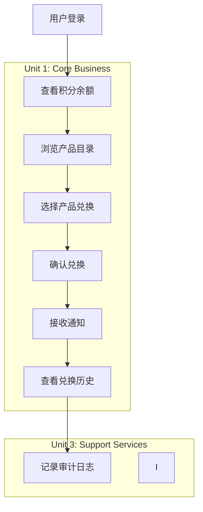
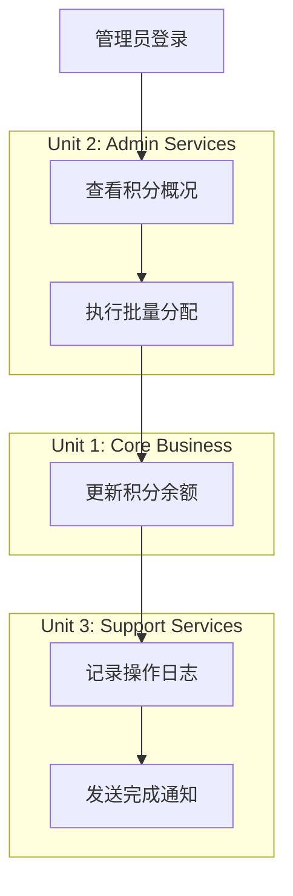

# Authentication & Authorization Design Extract

This document extracts all authentication and authorization related design elements from the AWSomeShop unit design documents.

## 1. User Management Component (Authentication Core)

### Component Overview
**Source**: `components.md`

**职责**:
- 用户认证和授权
- 用户信息管理
- 会话管理
- 权限验证

**边界**:
- 处理所有与用户身份相关的操作
- 不涉及业务逻辑处理
- 提供统一的认证接口

**接口**:
- 用户登录/登出
- 用户信息查询和更新
- 权限验证
- 会话管理

---

## 2. Authentication Service (Service Layer)

### Service Overview
**Source**: `services.md`

**职责**:
- 用户登录流程编排
- 会话管理
- 权限验证协调

**服务交互**:
- 调用 User Management Component 进行认证
- 与 Audit Component 记录登录日志
- 管理会话状态

**编排模式**:
```
用户登录请求 → 验证凭据 → 创建会话 → 记录日志 → 返回结果
```

**设计原则**:
- **Stateless Design (无状态设计)**: 服务不维护会话状态，所有状态信息通过参数传递，支持服务的水平扩展

---

## 3. Authentication Methods

### Component Methods
**Source**: `component-methods.md`

#### Authentication Methods
```python
def authenticate_user(username: str, password: str) -> AuthResult
    # 验证用户凭据，返回认证结果

def logout_user(session_token: str) -> bool
    # 用户登出，清除会话

def validate_session(session_token: str) -> UserSession
    # 验证会话有效性
```

#### User Information Methods
```python
def get_user_profile(user_id: int) -> UserProfile
    # 获取用户基本信息

def update_user_profile(user_id: int, profile_data: dict) -> bool
    # 更新用户信息

def check_user_permission(user_id: int, permission: str) -> bool
    # 检查用户权限
```

---

## 4. Component Dependencies (Authentication Context)

### User Management Component Dependencies
**Source**: `component-dependency.md`

**依赖组件**:
- Data Access Component: 用户数据存储和查询
- Audit Component: 用户操作日志记录

**被依赖组件** (Authentication is used by):
- Points Management: 用户身份验证
- Product Management: 用户权限验证
- Order Management: 用户信息获取
- Notification: 用户联系信息
- Admin Management: 管理员权限验证

**通信模式**: 直接方法调用

---

## 5. Authentication Data Flows

### User Login Flow
**Source**: `component-dependency.md`

```
用户登录请求
    ↓
User Management Component
    ↓ (验证凭据)
Data Access Component
    ↓ (记录登录日志)
Audit Component
    ↓
返回登录结果
```

### Product Redemption Flow (with Auth)
```
兑换请求
    ↓
Order Management Component
    ↓ (验证用户) ← Authentication Step
User Management Component
    ↓ (检查积分)
Points Management Component
    ↓ (检查库存)
Product Management Component
    ↓ (创建订单)
Data Access Component
    ↓ (扣除积分)
Points Management Component
    ↓ (更新库存)
Product Management Component
    ↓ (发送通知)
Notification Component
    ↓ (记录日志)
Audit Component
    ↓
返回兑换结果
```

### Monthly Points Allocation Flow (with Auth)
```
积分分配请求
    ↓
Admin Management Component
    ↓ (验证管理员权限) ← Authorization Step
User Management Component
    ↓ (执行批量分配)
Points Management Component
    ↓ (记录积分变动)
Data Access Component
    ↓ (发送通知)
Notification Component
    ↓ (记录操作日志)
Audit Component
    ↓
返回分配结果
```

---

## 6. Authentication in Unit of Work

### Unit 1: Core Business Unit
**Source**: `unit-of-work.md`

**包含组件**:
1. **User Management Component** - 用户认证和管理 ← Primary Auth Component

### User Story: US-001 用户登录
**Source**: `unit-of-work-story-map.md`

- **映射原因**: 系统基础功能，所有其他功能的前提
- **实现组件**: User Management Component
- **开发优先级**: P0 (最高)
- **预估工时**: 16小时
- **依赖关系**: 无前置依赖
- **验收标准**: 
  - 用户可以使用用户名和密码登录
  - 登录成功后获得访问令牌
  - 登录失败显示错误信息

---

## 7. Authentication Audit & Logging

### Audit Component Integration
**Source**: `unit-of-work-dependency.md`

**记录的操作类型**:
- 用户登录/登出
- 积分余额查询
- 产品兑换
- 管理员操作

**审计数据流**:
```
Business Components → Audit Service
- 用户标识 (user_id)
- 操作类型 (login, redeem, query)
- 操作详情 (product_id, points_used, etc.)
- 时间戳和来源
```

### Audit Methods for Authentication
**Source**: `component-methods.md`

```python
def log_user_action(user_id: int, action: str, details: dict) -> bool
    # 记录用户操作日志 (包括登录/登出)

def log_system_event(event_type: str, details: dict) -> bool
    # 记录系统事件日志

def log_error(error_type: str, error_details: dict, context: dict) -> bool
    # 记录错误日志 (包括认证失败)
```

---

## 8. Authentication Error Handling

### Error Handling Strategy
**Source**: `services.md`

#### Business Errors (业务错误)
- 返回结果对象包含错误信息
- 错误码标准化
- 用户友好的错误消息

#### System Errors (系统错误)
- 抛出异常进行处理
- 统一的异常处理机制
- 错误日志记录

### Error Propagation Pattern
**Source**: `component-dependency.md`

```python
# 返回结果对象模式
class ComponentResult:
    def __init__(self, success: bool, data=None, error=None):
        self.success = success
        self.data = data
        self.error = error

# 认证方法返回结果对象
def authenticate_user(username, password):
    try:
        # 认证逻辑处理
        result = perform_authentication(username, password)
        return ComponentResult(success=True, data=result)
    except AuthenticationException as e:
        return ComponentResult(success=False, error=e.message)
```

---

## 9. Authentication Testing Strategy

### Unit Testing
**Source**: `component-dependency.md`

- 每个组件独立测试
- 使用模拟对象替代依赖组件
- 测试组件的核心业务逻辑

**Authentication Specific Tests**:
- 测试有效凭据的认证
- 测试无效凭据的认证失败
- 测试会话验证
- 测试权限检查

### Integration Testing
- 测试组件间的交互
- 验证数据流的正确性
- 测试事务的一致性

**Authentication Integration Tests**:
- 端到端登录流程测试
- 认证与审计日志集成测试
- 权限验证与业务操作集成测试

---

## 10. Authentication Performance Considerations

### Caching Strategy
**Source**: `services.md`

- 服务层实现缓存逻辑
- 缓存热点数据
- 缓存失效策略

**Authentication Caching**:
- 会话信息缓存
- 用户权限缓存
- 减少数据库查询

### Synchronous Service Calls
**Source**: `services.md`

**使用场景**:
- 核心业务流程（登录、兑换）
- 需要立即响应的操作
- 事务性操作

**实现方式**:
- 直接方法调用
- 同步错误处理
- 事务边界管理

---

## 11. Authentication Data Flow in User Journey

### Employee User Journey (with Authentication)
**Source**: `unit-of-work-dependency.md`



### Admin User Journey (with Authorization)


---

## 12. Authentication Design Principles

### Dependency Management
**Source**: `component-dependency.md`

#### Layered Architecture (分层架构)
- **表示层**: Web Controllers (处理认证令牌)
- **服务层**: Business Services (认证服务编排)
- **组件层**: Business Components (User Management Component)
- **数据层**: Data Access Component (用户数据存储)

#### Dependency Inversion (依赖倒置)
- 高层组件不依赖低层组件的具体实现
- 通过接口定义依赖关系
- 支持组件的独立测试和替换

#### Minimal Dependencies (最小依赖)
- 组件只依赖必要的其他组件
- 减少不必要的耦合
- 支持组件的独立演化

---

## 13. Authentication Implementation Checklist

Based on the design documents, authentication implementation should include:

### Core Components
- [ ] User Management Component
  - [ ] authenticate_user() method
  - [ ] logout_user() method
  - [ ] validate_session() method
  - [ ] check_user_permission() method

### Service Layer
- [ ] Authentication Service
  - [ ] Login flow orchestration
  - [ ] Session management
  - [ ] Permission validation coordination

### Data Layer
- [ ] User data model
- [ ] Session data model
- [ ] User credentials storage (hashed passwords)

### Audit & Logging
- [ ] Login/logout event logging
- [ ] Authentication failure logging
- [ ] Permission check logging

### Error Handling
- [ ] Authentication exceptions
- [ ] Authorization exceptions
- [ ] User-friendly error messages

### Testing
- [ ] Unit tests for authentication methods
- [ ] Integration tests for login flow
- [ ] Security tests for password handling
- [ ] Performance tests for session validation

---

## Summary

The authentication and authorization design in AWSomeShop follows a layered architecture with:

1. **User Management Component** as the core authentication component
2. **Authentication Service** for orchestrating login flows
3. **Stateless design** for scalability
4. **Comprehensive audit logging** for all auth events
5. **Clear dependency management** with User Management being a foundational component
6. **Standardized error handling** for both business and system errors
7. **Integration with all business components** for permission validation

The design emphasizes separation of concerns, testability, and maintainability while providing a secure foundation for the entire application.
