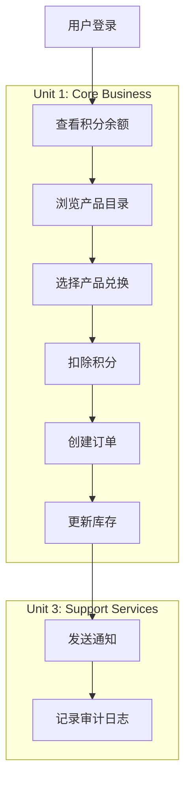
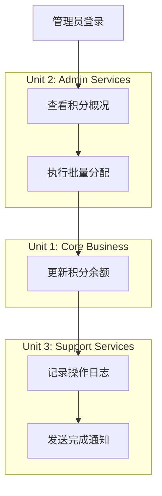

# AWSomeShop 工作单元依赖关系

## 依赖关系矩阵

### 单元依赖概览

| 单元 | Unit 1 (Core Business) | Unit 2 (Admin Services) | Unit 3 (Support Services) |
|------|------------------------|--------------------------|----------------------------|
| **Unit 1 (Core Business)** | - | 被依赖 | 依赖 |
| **Unit 2 (Admin Services)** | 依赖 | - | 依赖 |
| **Unit 3 (Support Services)** | 被依赖 | 被依赖 | - |

### 依赖关系详细说明

## Unit 1 → Unit 3 依赖关系

### 1.1 通知服务依赖
**依赖场景**: 兑换成功后发送邮件通知

**调用方**: Order Management Component (Unit 1)
**被调用方**: Notification Component (Unit 3)

**接口定义**:
```python
# Unit 1 调用 Unit 3
async def send_redemption_notification(order_id: str, user_email: str, product_name: str):
    notification_data = {
        "order_id": order_id,
        "user_email": user_email,
        "product_name": product_name,
        "redemption_time": datetime.now()
    }
    return await NotificationService.send_email(
        to=user_email,
        template="redemption_success",
        data=notification_data
    )
```

**数据流**:
```
Order Management → Notification Service
- 订单信息 (order_id, user_email, product_name)
- 模板类型 (redemption_success)
- 通知数据 (redemption_time, etc.)
```

**错误处理**:
- 通知发送失败不影响兑换流程
- 异步处理，支持重试机制
- 记录通知状态供后续查询

### 1.2 审计日志依赖
**依赖场景**: 记录关键业务操作

**调用方**: 所有 Unit 1 组件
**被调用方**: Audit Component (Unit 3)

**接口定义**:
```python
# Unit 1 调用 Unit 3
def log_business_operation(user_id: str, operation: str, details: dict):
    audit_data = {
        "user_id": user_id,
        "operation": operation,
        "details": details,
        "timestamp": datetime.now(),
        "source_unit": "core-business"
    }
    AuditService.log_operation(audit_data)
```

**记录的操作类型**:
- 用户登录/登出
- 积分余额查询
- 产品兑换
- 订单创建

**数据流**:
```
Business Components → Audit Service
- 用户标识 (user_id)
- 操作类型 (login, redeem, query)
- 操作详情 (product_id, points_used, etc.)
- 时间戳和来源
```

## Unit 2 → Unit 1 依赖关系

### 2.1 数据模型依赖
**依赖场景**: 管理功能需要访问核心业务数据

**调用方**: Admin Management Component (Unit 2)
**被调用方**: Data Access Component (Unit 1)

**接口定义**:
```python
# Unit 2 调用 Unit 1 的数据访问接口
class AdminPointsService:
    def __init__(self, points_service: PointsService):
        self.points_service = points_service
    
    def get_all_user_balances(self) -> List[UserBalance]:
        return self.points_service.get_all_balances()
    
    def bulk_allocate_points(self, allocations: List[PointsAllocation]):
        return self.points_service.bulk_update(allocations)
```

**共享数据模型**:
- Users (用户基础信息)
- Points (积分余额)
- PointsHistory (积分变动历史)
- Products (产品信息)
- Orders (订单数据)

### 2.2 业务逻辑扩展
**依赖场景**: 管理功能扩展核心业务能力

**调用方**: Admin Management Component (Unit 2)
**被调用方**: Points Management Component (Unit 1)

**接口定义**:
```python
# Unit 2 扩展 Unit 1 的业务逻辑
class AdminProductService:
    def __init__(self, product_service: ProductService):
        self.product_service = product_service
    
    def create_product(self, product_data: dict) -> Product:
        # 管理员特有的产品创建逻辑
        validated_data = self.validate_admin_product_data(product_data)
        return self.product_service.create(validated_data)
    
    def update_inventory(self, product_id: str, quantity: int):
        return self.product_service.update_inventory(product_id, quantity)
```

## Unit 2 → Unit 3 依赖关系

### 2.1 管理操作审计
**依赖场景**: 记录管理员操作

**调用方**: Admin Management Component (Unit 2)
**被调用方**: Audit Component (Unit 3)

**接口定义**:
```python
# Unit 2 调用 Unit 3
def log_admin_operation(admin_id: str, operation: str, target: str, details: dict):
    audit_data = {
        "admin_id": admin_id,
        "operation": operation,
        "target": target,
        "details": details,
        "timestamp": datetime.now(),
        "source_unit": "admin-services",
        "risk_level": determine_risk_level(operation)
    }
    AuditService.log_admin_operation(audit_data)
```

**记录的管理操作**:
- 积分批量分配
- 手动积分调整
- 产品管理操作
- 库存调整

### 2.2 批量操作通知
**依赖场景**: 批量操作完成后通知相关人员

**调用方**: Admin Management Component (Unit 2)
**被调用方**: Notification Component (Unit 3)

**接口定义**:
```python
# Unit 2 调用 Unit 3
async def notify_bulk_operation_complete(operation_id: str, admin_email: str, summary: dict):
    notification_data = {
        "operation_id": operation_id,
        "operation_type": summary["type"],
        "affected_users": summary["user_count"],
        "total_points": summary["points_total"],
        "completion_time": datetime.now()
    }
    return await NotificationService.send_email(
        to=admin_email,
        template="bulk_operation_complete",
        data=notification_data
    )
```

## 依赖管理策略

### 1. 依赖注入模式
**实现方式**: 使用依赖注入容器管理单元间依赖

```python
# 依赖注入配置
class DIContainer:
    def __init__(self):
        # Unit 3 - 基础服务
        self.notification_service = NotificationService()
        self.audit_service = AuditService()
        
        # Unit 1 - 核心业务 (注入 Unit 3 依赖)
        self.points_service = PointsService(
            audit_service=self.audit_service
        )
        self.order_service = OrderService(
            notification_service=self.notification_service,
            audit_service=self.audit_service
        )
        
        # Unit 2 - 管理服务 (注入 Unit 1 和 Unit 3 依赖)
        self.admin_service = AdminService(
            points_service=self.points_service,
            audit_service=self.audit_service,
            notification_service=self.notification_service
        )
```

### 2. 接口抽象化
**实现方式**: 定义抽象接口减少直接依赖

```python
# 抽象接口定义
from abc import ABC, abstractmethod

class NotificationServiceInterface(ABC):
    @abstractmethod
    async def send_email(self, to: str, template: str, data: dict) -> str:
        pass

class AuditServiceInterface(ABC):
    @abstractmethod
    def log_operation(self, operation_data: dict) -> None:
        pass

# Unit 1 依赖抽象接口而非具体实现
class OrderService:
    def __init__(self, 
                 notification_service: NotificationServiceInterface,
                 audit_service: AuditServiceInterface):
        self.notification_service = notification_service
        self.audit_service = audit_service
```

### 3. 异步通信模式
**实现方式**: 使用事件驱动减少同步依赖

```python
# 事件驱动通信
class EventBus:
    def __init__(self):
        self.subscribers = {}
    
    def subscribe(self, event_type: str, handler):
        if event_type not in self.subscribers:
            self.subscribers[event_type] = []
        self.subscribers[event_type].append(handler)
    
    async def publish(self, event_type: str, event_data: dict):
        if event_type in self.subscribers:
            for handler in self.subscribers[event_type]:
                await handler(event_data)

# Unit 1 发布事件
class OrderService:
    async def complete_redemption(self, order_id: str):
        # 完成兑换业务逻辑
        order = await self.finalize_order(order_id)
        
        # 发布事件而非直接调用
        await event_bus.publish("redemption_completed", {
            "order_id": order_id,
            "user_email": order.user_email,
            "product_name": order.product_name
        })

# Unit 3 订阅事件
async def handle_redemption_completed(event_data: dict):
    await NotificationService.send_redemption_notification(event_data)

event_bus.subscribe("redemption_completed", handle_redemption_completed)
```

## 数据流图

### 完整业务流程数据流


### 管理员操作数据流


## 依赖关系验证

### 循环依赖检查
✅ **无循环依赖**: 依赖关系形成有向无环图(DAG)
- Unit 1 → Unit 3
- Unit 2 → Unit 1
- Unit 2 → Unit 3
- 无反向依赖

### 依赖强度分析
- **Unit 1 → Unit 3**: 弱依赖 (异步通信)
- **Unit 2 → Unit 1**: 强依赖 (数据模型共享)
- **Unit 2 → Unit 3**: 弱依赖 (审计和通知)

### 解耦策略
1. **接口隔离**: 通过抽象接口减少实现依赖
2. **事件驱动**: 异步事件减少同步调用依赖
3. **配置外化**: 依赖关系通过配置管理
4. **模块边界**: 清晰的模块边界和职责划分

## 部署依赖管理

### 启动顺序
1. **Unit 3** (Support Services) - 基础服务先启动
2. **Unit 1** (Core Business) - 核心业务依赖基础服务
3. **Unit 2** (Admin Services) - 管理服务最后启动

### 健康检查
```python
# 依赖健康检查
class HealthChecker:
    async def check_dependencies(self):
        checks = {
            "notification_service": await self.check_notification_service(),
            "audit_service": await self.check_audit_service(),
            "database": await self.check_database(),
        }
        return all(checks.values()), checks
```

### 故障隔离
- **Unit 3 故障**: Unit 1 核心功能继续可用，通知和审计功能降级
- **Unit 1 故障**: Unit 2 管理功能部分不可用
- **Unit 2 故障**: 不影响 Unit 1 和 Unit 3 的正常运行