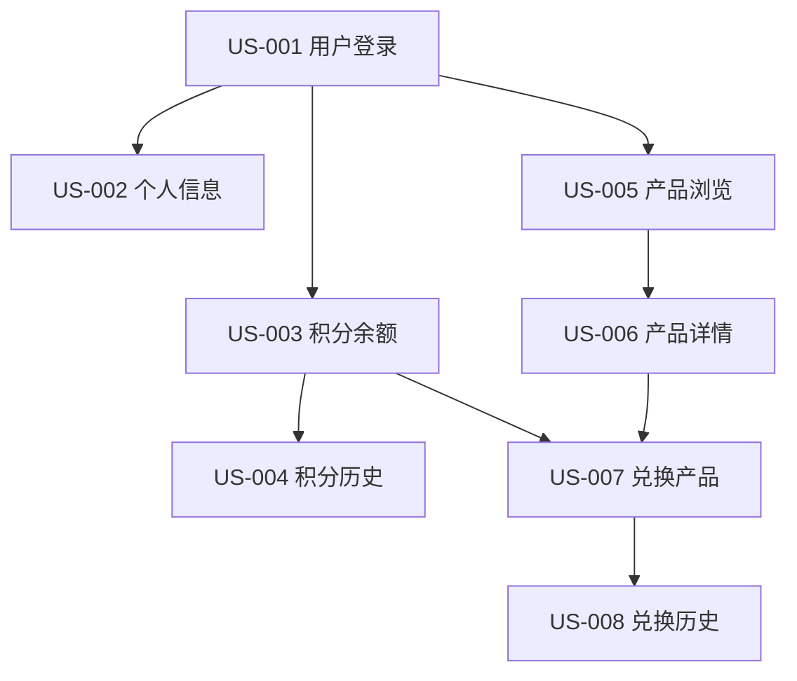
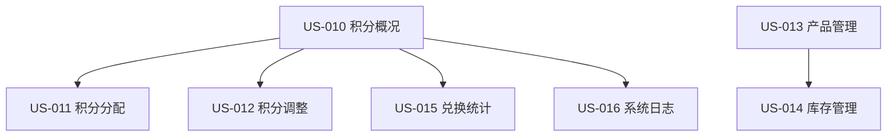
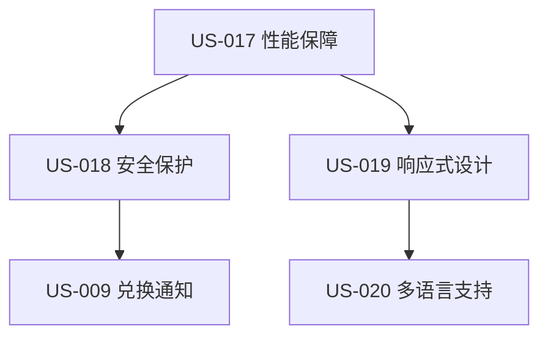

# AWSomeShop 用户故事到工作单元映射

## 映射策略总结

基于用户选择的**按优先级分配**策略，将20个用户故事按照以下原则分配到3个工作单元：

1. **MVP核心故事优先分配到Unit 1** - 确保核心业务功能完整
2. **管理员故事分配到Unit 2** - 集中管理功能开发
3. **支撑功能故事分配到Unit 3** - 提供基础设施支持

## 故事分配概览

| 工作单元 | 故事数量 | MVP核心 | MVP重要 | 后续迭代 |
|----------|----------|---------|---------|----------|
| **Unit 1: Core Business** | 8个 | 6个 🔴 | 2个 🟡 | 0个 |
| **Unit 2: Admin Services** | 7个 | 5个 🔴 | 2个 🟡 | 0个 |
| **Unit 3: Support Services** | 5个 | 2个 🔴 | 2个 🟡 | 1个 🟢 |

## Unit 1: 核心业务单元 - 故事映射

### MVP核心故事 (🔴 必需实现)

#### US-001: 用户登录
- **映射原因**: 系统基础功能，所有其他功能的前提
- **实现组件**: User Management Component
- **开发优先级**: P0 (最高)
- **预估工时**: 8小时
- **依赖关系**: 无前置依赖
- **验收标准**: 用户可以安全登录并获得会话令牌

#### US-003: 查看积分余额
- **映射原因**: 核心用户需求，兑换决策的基础
- **实现组件**: Points Management Component
- **开发优先级**: P0
- **预估工时**: 6小时
- **依赖关系**: 依赖 US-001 用户登录
- **验收标准**: 首页显示实时积分余额

#### US-005: 浏览产品目录
- **映射原因**: 核心业务功能，用户发现产品的入口
- **实现组件**: Product Management Component
- **开发优先级**: P1
- **预估工时**: 16小时
- **依赖关系**: 依赖 US-001 用户登录
- **验收标准**: 显示所有可兑换产品，支持分类和排序

#### US-006: 查看产品详情
- **映射原因**: 兑换前置条件，用户决策必需信息
- **实现组件**: Product Management Component
- **开发优先级**: P1
- **预估工时**: 10小时
- **依赖关系**: 依赖 US-005 产品浏览
- **验收标准**: 显示完整产品信息和兑换按钮

#### US-007: 兑换产品
- **映射原因**: 系统核心业务流程，最重要的功能
- **实现组件**: Order Management Component
- **开发优先级**: P0
- **预估工时**: 20小时
- **依赖关系**: 依赖 US-003, US-006
- **验收标准**: 完整的兑换流程，积分扣除，订单生成

#### US-008: 查看兑换历史
- **映射原因**: 用户体验必需，订单跟踪功能
- **实现组件**: Order Management Component
- **开发优先级**: P1
- **预估工时**: 14小时
- **依赖关系**: 依赖 US-007 兑换产品
- **验收标准**: 显示完整兑换记录，支持筛选和分页

### MVP重要故事 (🟡 建议实现)

#### US-002: 查看个人信息
- **映射原因**: 增强用户体验，账户信息确认
- **实现组件**: User Management Component
- **开发优先级**: P2
- **预估工时**: 4小时
- **依赖关系**: 依赖 US-001 用户登录
- **验收标准**: 显示用户基本信息，只读模式

#### US-004: 查看积分变动历史
- **映射原因**: 积分透明度，用户信任建立
- **实现组件**: Points Management Component
- **开发优先级**: P2
- **预估工时**: 12小时
- **依赖关系**: 依赖 US-003 积分余额
- **验收标准**: 显示详细积分变动记录，支持筛选

### Unit 1 开发路径

## Unit 2: 管理服务单元 - 故事映射

### MVP核心故事 (🔴 必需实现)

#### US-010: 查看员工积分概况
- **映射原因**: 管理基础功能，积分系统监控
- **实现组件**: Admin Management Component
- **开发优先级**: P1
- **预估工时**: 16小时
- **依赖关系**: 依赖 Unit 1 积分数据模型
- **验收标准**: 显示所有员工积分状态，支持筛选和导出

#### US-011: 执行月度积分分配
- **映射原因**: 业务核心流程，积分系统运营基础
- **实现组件**: Admin Management Component
- **开发优先级**: P0
- **预估工时**: 24小时
- **依赖关系**: 依赖 US-010 积分概况
- **验收标准**: 支持批量积分分配，事务安全，操作审计

#### US-012: 手动调整员工积分
- **映射原因**: 管理必需功能，特殊情况处理
- **实现组件**: Admin Management Component
- **开发优先级**: P1
- **预估工时**: 18小时
- **依赖关系**: 依赖 US-010 积分概况
- **验收标准**: 支持单个和批量调整，必须记录原因

#### US-013: 管理产品目录
- **映射原因**: 业务基础功能，产品生命周期管理
- **实现组件**: Admin Management Component
- **开发优先级**: P1
- **预估工时**: 20小时
- **依赖关系**: 依赖 Unit 1 产品数据模型
- **验收标准**: 完整的产品CRUD操作，图片上传

#### US-014: 管理产品库存
- **映射原因**: 业务必需功能，库存控制
- **实现组件**: Admin Management Component
- **开发优先级**: P1
- **预估工时**: 12小时
- **依赖关系**: 依赖 US-013 产品管理
- **验收标准**: 库存调整，预警设置，变动记录

### MVP重要故事 (🟡 建议实现)

#### US-015: 查看兑换统计
- **映射原因**: 数据分析支持，业务决策依据
- **实现组件**: Admin Management Component
- **开发优先级**: P2
- **预估工时**: 16小时
- **依赖关系**: 依赖 Unit 1 订单数据
- **验收标准**: 多维度统计报表，图表展示

#### US-016: 查看系统日志
- **映射原因**: 系统监控，安全审计
- **实现组件**: Admin Management Component
- **开发优先级**: P2
- **预估工时**: 14小时
- **依赖关系**: 依赖 Unit 3 审计系统
- **验收标准**: 日志查询，筛选，导出功能

### Unit 2 开发路径

## Unit 3: 支撑服务单元 - 故事映射

### MVP核心故事 (🔴 必需实现)

#### US-017: 系统性能保障
- **映射原因**: 技术基础要求，系统可用性保证
- **实现组件**: 跨所有组件的技术实现
- **开发优先级**: P0
- **预估工时**: 20小时
- **依赖关系**: 贯穿整个系统开发
- **验收标准**: 支持50-200并发用户，响应时间达标

#### US-018: 数据安全保护
- **映射原因**: 安全基础要求，数据保护必需
- **实现组件**: 跨所有组件的安全实现
- **开发优先级**: P0
- **预估工时**: 16小时
- **依赖关系**: 贯穿整个系统开发
- **验收标准**: 数据加密，权限控制，安全审计

### MVP重要故事 (🟡 建议实现)

#### US-009: 接收兑换通知
- **映射原因**: 用户体验增强，兑换确认机制
- **实现组件**: Notification Component
- **开发优先级**: P2
- **预估工时**: 8小时
- **依赖关系**: 依赖 US-007 兑换产品
- **验收标准**: 自动邮件发送，模板管理，送达跟踪

#### US-019: 响应式界面设计
- **映射原因**: 多设备支持，用户体验优化
- **实现组件**: 前端UI框架和设计系统
- **开发优先级**: P2
- **预估工时**: 12小时
- **依赖关系**: 贯穿前端开发
- **验收标准**: 多设备适配，触摸友好，性能优化

### 后续迭代故事 (🟢 未来实现)

#### US-020: 多语言支持
- **映射原因**: 国际化需求，用户体验提升
- **实现组件**: 国际化框架和语言包
- **开发优先级**: P3
- **预估工时**: 8小时
- **依赖关系**: 依赖完整的UI实现
- **验收标准**: 中文界面，本地化格式，语言切换

### Unit 3 开发路径

## 跨单元故事协调

### 故事间依赖关系

#### 强依赖关系 (必须按顺序实现)
1. **US-001** → **US-003** → **US-007** (登录 → 积分 → 兑换)
2. **US-005** → **US-006** → **US-007** (浏览 → 详情 → 兑换)
3. **US-007** → **US-008** (兑换 → 历史)
4. **US-007** → **US-009** (兑换 → 通知)
5. **US-010** → **US-011** (概况 → 分配)

#### 弱依赖关系 (可并行开发)
1. **US-002** 与 **US-004** (个人信息与积分历史)
2. **US-013** 与 **US-014** (产品管理与库存管理)
3. **US-015** 与 **US-016** (统计与日志)

### 集成测试故事

#### IT-001: 端到端兑换流程测试
**涉及单元**: Unit 1 + Unit 3
**测试场景**: 
- 用户登录 → 查看积分 → 浏览产品 → 兑换 → 接收通知
**验收标准**: 完整流程无错误，数据一致性

#### IT-002: 管理员批量操作测试
**涉及单元**: Unit 2 + Unit 1 + Unit 3
**测试场景**:
- 管理员登录 → 批量分配积分 → 审计记录 → 通知确认
**验收标准**: 批量操作成功，审计完整

#### IT-003: 系统性能压力测试
**涉及单元**: 所有单元
**测试场景**:
- 50-200并发用户同时进行各种操作
**验收标准**: 响应时间达标，系统稳定

## 开发里程碑和交付计划

### 里程碑1: 核心功能可用 (Week 6)
**交付内容**:
- Unit 1: US-001, US-003, US-005, US-006, US-007, US-008
- Unit 3: US-017, US-018 (基础实现)
**验收标准**: 员工可以完成完整的兑换流程

### 里程碑2: 管理功能完整 (Week 10)
**交付内容**:
- Unit 2: US-010, US-011, US-012, US-013, US-014
- Unit 1: US-002, US-004 (增强功能)
**验收标准**: 管理员可以完成所有管理操作

### 里程碑3: 系统功能完整 (Week 13)
**交付内容**:
- Unit 3: US-009, US-019 (完整实现)
- Unit 2: US-015, US-016 (监控功能)
- 集成测试和优化
**验收标准**: 系统功能完整，性能达标，可以上线

### 里程碑4: 体验优化 (未来迭代)
**交付内容**:
- Unit 3: US-020 (多语言支持)
- 性能优化和用户体验提升
**验收标准**: 用户体验优秀，支持多语言

## 质量保证策略

### 单元内测试
- **Unit 1**: 业务逻辑单元测试，API接口测试
- **Unit 2**: 管理功能测试，权限验证测试
- **Unit 3**: 服务接口测试，通知发送测试

### 跨单元集成测试
- **Unit 1 ↔ Unit 3**: 通知和审计集成测试
- **Unit 2 ↔ Unit 1**: 数据访问和业务逻辑集成测试
- **Unit 2 ↔ Unit 3**: 管理审计和通知集成测试

### 端到端测试
- 完整用户旅程测试
- 管理员操作流程测试
- 异常场景和错误处理测试

## 风险管理

### 故事实现风险
1. **US-007 兑换产品**: 复杂度高，涉及多个组件协调
   - 缓解: 分阶段实现，先实现基础流程
   
2. **US-011 批量积分分配**: 性能和数据一致性挑战
   - 缓解: 使用数据库事务，异步处理

3. **US-017 系统性能**: 跨所有单元的技术要求
   - 缓解: 持续性能监控，渐进式优化

### 依赖关系风险
1. **Unit 1 延迟影响 Unit 2**: 管理功能依赖核心业务
   - 缓解: 并行开发接口定义，模拟数据测试
   
2. **Unit 3 延迟影响通知**: 兑换流程依赖通知服务
   - 缓解: 通知服务异步化，降级处理

### 集成风险
1. **数据模型不一致**: 跨单元数据访问问题
   - 缓解: 统一数据访问层，严格接口定义
   
2. **性能瓶颈**: 单元间通信开销
   - 缓解: 优化接口设计，减少不必要的调用